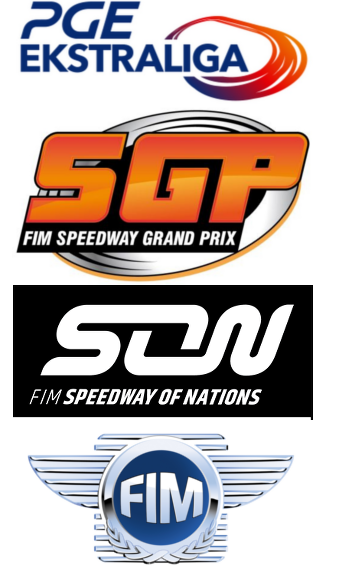

Using online updating algorithms to predict speedway results.
========================================================
title: Using online updating algorithms to predict speedway results.
author: Dawid Kałędkowski@ClickMeeting
date: 2018-07-04
font-family: 'Helvetica Semi-Light'
autosize: true
css: presentation.css

Speedway is a motorcycle sport
========================================================

- Motorbike sport on oval dirt-track
- 4 Riders race 4 laps
- Start signaled by tape rise and light
- Exclusions for falling, engine failures, touching tape etc.
- Sliding scale for scoring (3-2-1-0)


More than 1000 events annualy (2017)
========================================================
left: 25%


***

  - 1000 riders from 31 countries
  - 100 different competitions.
  - Individual competitions - Grand-Prix
  - League matches - PGE Ekstraliga, Premiership, Elitserien, Bundesliga etc.
  - Team competitions - SWC/SON
  - Pair competitions - SBP


Statistics matters
========================================================


Approach to data is old-fashioned
=================================


<font size=3>*source: sportowefakty.pl/zuzel, speedwayupdates.proboards.com, speedwayresults.com*</font>


Data gathering partially automated
========================================================
left: 63%

- Multiple scrapes for different pages (`rvest`,`RSelenium` and a lot of `REGEXP`)
- PDF Parsers (`tabulizer`)
- Approximate names matching (`stringdist::amatch`)
- Web application to browse and update results (`shiny`, `rhandsontable` with `RMySQL`)
- Additional verification (comparing individual sums, squads sums, team sums)

***


Actual speedway database
========================================================

- 3 years of collecting data. 
- 10528 events in 148 competitions.
- Almost 700k individual performances.
- Unified rider names, competitions, places.
- 241 Speedway stadiums with coordinates.


Analytical challange
========================================================
left: 63%

- Output is a ranking
- Need for continuous updates
- Some commonly known effects need to be examined:
  - Riders form changes in time
  - Many interactions (`gate*heat*stadium`)
  - Field advantage
  - Winter break

***


Online Algorithms
========================================================

- Logit as underlying function 
- Model is estimated using Bayesian Approximation Method
$$\large R_i^{'} \leftarrow R_i + K * ( Y_i - \hat{Y_i}  )$$
    
- Update doesn't require previous data
- Computationaly efficient

Elo
========================================================
left: 63%


- Points gain depends only on ratings difference
- First widely known algorithm
- Very succesful in leagues for 2-player games:
  - FIFA ranking
  - US Chess Federation (USCF)
  - World Chess Federation (FIDE)

***


<font size=3>*source: https://www.fide.com/fide/handbook.html?id=172&view=article*</font>


Glicko (sport::glicko)
========================================================

$$\large \hat{Y_{ij}} = P(X_i>X_j) = \frac{1}{ 1 + 10^{-g(RD_{ij}) * (R_i-R_j)/400}} $$

$$\large {R'}_i = R_i +  \frac{1}{\frac{1}{{RD}^2_{i}} + \frac{1}{d^2_i}} * \sum_j{g(RD_j) * (Y_{ij} - \hat{Y_{ij}})  }$$
$$\large {RD'}_i = \sqrt{(\frac{1}{{RD}^2_{i}} + \frac{1}{d^2_i}})^{-1}$$

- New parameter RD - rating deviation


Glicko2 (sport::glicko2)
========================================================

$$\large \hat{Y_{ij}} = \frac{1}{1 + e^{-g(\phi_{ij})*(\mu_i  - \mu_j)} }$$

$$\large {\phi'}_i = \frac{1}{\sqrt{ \frac{1}{ { {\phi_i}^2 + {\sigma'_i}^2}} + \frac{1}{v}  }}$$

$$\large {\mu'_i} = \mu_i + {\phi'}_i * \sum_j{g(\phi_j)*(Y_{ij} - \hat{Y_{ij}})} $$

- New parameter $\sigma$ measures volatility


Bayesian Bradley Terry (sport::bbt)
========================================================

$$\large \hat{Y_{ij}} = P(X_i>X_j) = \frac{e^{R_i/c_{i_j}}}{e^{R_i/c_{ij}} + e^{R_j/c_{ij}}} $$

$$\large {R'}_i = R_i + \sum_j{\frac{RD_i^2}{c_{ij}}*(Y_{ij} - \hat{Y_{ij}})}$$
$$\large {RD'}_i = RD_i * [ 1 - \frac{RD_{ij}^2}{RD_i^2}\sum_j{ \gamma_j * (\frac{RD_i}{c_{ij}})^2* \hat{Y_{ij}}\hat{Y_{ji}}   } ]$$

- Able to measure individual ratings within teams.


Dynamic Bayesian Logit (sport::bdl)
========================================================

- Algorithm has learning rate parameter - low at stationary regions and high in regions of nonstationarity to allow tracking.
- Able to estimate many induvidual specific parameters

$$\large \beta_t = {\beta_{t-1}} + \eta_t$$

$$\large Y_t = \frac{e^{z}}{1+e^{z_{t}}}$$

$$\small z_t = \beta_{it}^Tx_{it}-\beta_{jt}^Tx_{jt}$$

$$\small w_t = w_{t-1} + {\sum{_t}} x_t$$

`sport` - package for sport analytics
========================================================

- Installation - package available on github.com/gogonzo/sport. Still under development, far from final product but syntax won't change. 

<font size=6>

```r
# devtools::install_github("gogonzo/sport")
library(sport)
```
</font>

- To estimate riders (`rider_name`) abilities with given outputs (`rank`) nested within particular heats (`id`)

<font size=5>

```r
list_glicko   <- glicko_run( formula = rank|id ~ rider_name , 
                             data    = gpheats )
```
</font>

`sport` - package for sport analytics
========================================================
Output contains:
- `r` `data.frame` with all historical parameters (ratings and ratings deviations) estimation
- `pairs` data.frame` with pair combination within heats with estimated winning probability
- `final_r` actual ratings estimations
- `final_rd` actual ratings deviations

<font size=5>

```r
names( list_glicko )
```

```
[1] "r"        "pairs"    "final_r"  "final_rd"
```
</font>

<font size=5>

```r
head( list_glicko$r )
tail( list_glicko$pairs )
```
</font>

Methods perform similarly.
========================================================


Ensemble models doesn't improve performance.
========================================================
left: 37%


***

- xgBoost, Random Forests nor Boosted trees didn't improve accuracy.
- Additional variables have no additional predictive abilities.

Non-rating vars contribution <5%
========================================================


The Best speedway riders
========================================================


TODO
========================================================

- Searching for perfect predictive model.
- Improve `sport` package.
- Simulate events results.
- Promote data-science in speedway.

References
========================================================

References:
- Mark E. Glickman (1999): Parameter estimation in large dynamic paired comparison experiments. *Applied Statistics*, 48:377-394.
URL http://www.glicko.net/research/glicko.pdf

- Mark E. GLickman (2001): Dynamic paired comparison models with stochastic variances, *Journal of Applied Statistics*, 28:673-689.
URL http://www.glicko.net/research/dpcmsv.pdf

- Mark E. Glickman (1995): A Comprehensive guide to chess ratings. *American Chess Journal*, 3, pp. 59--102.
http://www.glicko.net/research/acjpaper.pdf

- Ruby C. Weng and Chih-Jen Lin (2011): A Bayesian Approximation Method for Online Ranking. *Journal of Machine Learning Research*,12:267-300.
URL http://jmlr.csail.mit.edu/papers/volume12/weng11a/weng11a.pdf

- William D. Penny and Stephen J. Roberts (1999): Dynamic Logistic Regression, Departament of Electrical and Electronic Engineering, Imperial College


Thank you
========================================================
</br>
</br>
</br>
<a href="https://github.com/gogonzo">github.com/gogonzo</a>

<a href="mailto:dawid.kaledkowski@clickmeeting.com">dawid.kaledkowski@clickmeeting.com</a>

<a href="https://github.com/gogonzo">linkedin.com/in/dawidkaledkowski/</a>
